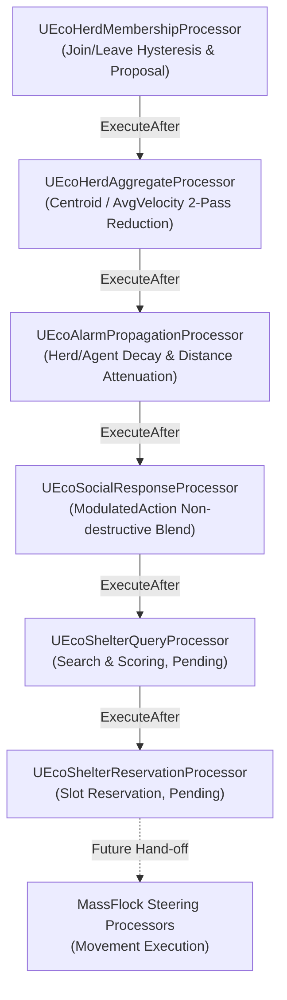

# Social Behavior & Shelter Runtime — Current State & Implementation Status

> **Project:** AdaptiveEcosystem (Unreal Engine 5.8)  
> **Repository:** `dpqksr5501/AdaptiveEcosystem`  
> **Target Module:** `AdaptiveEcosystem` (Source/AdaptiveEcosystem/AI/Social/)  
> **Active Base Branch:** `feat/social-alarm-mvp` (커밋 `8a4f31d` 기준)  
> **Last Updated:** 2026-09-21  
> **Status:** Dynamic Herd MVP (`Editor Verified`) / Alarm Communication MVP (`Editor Verified`) / Shelter MVP (`Pending`)

---

## 1. 문서의 목적 (Purpose)

이 문서는 `AdaptiveEcosystem`의 **Social Behavior & Shelter Runtime**의 현재 실제 구현 상태와 검증 결과를 기록한 단일 진실 문서(Single Source of Truth)입니다.  
새로운 AI Agent나 팀원이 작업에 참여할 때, 기존 설계 문서의 '의도'와 현재 소스 코드의 '실제 구현 상태'를 혼동하지 않고 즉시 작업을 이어갈 수 있도록 다음 상태 기준에 따라 명확히 구분하여 기술합니다:

- **`Editor Verified`**: C++ 코드 구현 완료 및 Unreal Editor (PIE) 환경에서 기능 실증 완료
- **`Implemented`**: C++ 코드 구현 및 UBT 컴파일/링크 완료 (에디터 통합 실증 진행 전)
- **`Pending`**: 기본 뼈대(Skeleton/Stub) 코드는 소스에 존재하나, 정식 고도화 및 검증 대기 중
- **`Deferred`**: 현재 MVP 스코프에서 의도적으로 배제/연기된 기능

---

## 2. 시스템 책임 경계 (System Boundaries & Ownership)

### 2.1 4대 계층 분리 원칙

```text
┌────────────────────────────────────────────────────────────────────────┐
│ 1. RL / PPO Behavior Policy (Aquarium / SB3 / C++ Native Inference)     │
│    - 책임: 개체의 고수준 행동 선호도(Behavior Tendency) 결정              │
│    - 입출력 불변 계약: Observation 7차원 / Raw Action 4차원               │
│    - Action = [ Forage, Cohesion, FleeDist, Cover ] (0.0 ~ 1.0)        │
└───────────────────────────────────┬────────────────────────────────────┘
                                    │ Raw Policy Action
                                    ▼
┌────────────────────────────────────────────────────────────────────────┐
│ 2. Social Behavior & Shelter Runtime (내 담당 영역)                      │
│    - 책임: 사회적 환경 문맥 판단, 군집 형성, 위험 전파, 은신처 슬롯 예약     │
│    - 산출물: FEcoSocialBehaviorFragment::ModulatedAction, TargetPosition │
│    - 역할: PPO Raw Action을 비파괴 보정하고 이동 목적지(Intent) 결정       │
└───────────────────────────────────┬────────────────────────────────────┘
                                    │ Modulated Forces & Target Location
                                    ▼
┌────────────────────────────────────────────────────────────────────────┐
│ 3. MassFlock / Movement (다른 팀원 소유 — 수정/재작성 절대 금지)          │
│    - 책임: 개체의 실제 물리적 이동, 조향(Steering), 로컬 군집 이동 실행     │
│    - 주의: Social Runtime은 '어디로 갈지(Intent)'만 제공하며,           │
│            '어떻게 물리적으로 이동할지(Steering)'는 MassFlock이 전담     │
└────────────────────────────────────────────────────────────────────────┘
                                    │
┌───────────────────────────────────┴────────────────────────────────────┐
│ 4. World / Ecology Simulation (Server / Standalone Authoritative)       │
│    - 책임: 생태계 자원, 영속 ID, 피식 기록 관리 (Subsystem은 로컬 서비스)│
└────────────────────────────────────────────────────────────────────────┘
```

### 2.2 엄격한 제약 사항
1. **PPO Policy V1 계약 불변**: 7차원 관측, 4차원 행동의 순서, 정규화 공식, 클램프 범위 수정 금지.
2. **PPO Raw Action 영구 보존**: `FEcoPolicyOutputFragment`는 `EMassFragmentAccess::ReadOnly`로 보호하며 직접 덮어쓰기 금지.
3. **MassFlock 침범 금지**: 로컬 조향 로직을 Social Runtime에 작성하지 않음.
4. **GameThread 직렬화 준수**: Mass 병렬 청크 루프 내부에서 `UWorldSubsystem`의 가변 상태를 직접 수정하지 않고, **Proposal $\to$ Reconciliation** 패턴 사용.

---

## 3. 전체 데이터 흐름 및 Mass Processor 실행 순서

### 3.1 런타임 데이터 흐름 (Runtime Flow)
1. **Policy 추론**: PPO 모델이 7차원 관측을 읽어 `FEcoPolicyOutputFragment.Action` 출력.
2. **Herd 갱신**: 인접 엔티티들이 Hysteresis 반경을 기반으로 무리에 소속되고 중심/평균속도 산출.
3. **Threat 수신 & 감쇠**: 외부 위협 발생 시 Herd가 수신 후 구성원에게 거리 지수 감쇠($e^{-\alpha d}$) 전파 및 시간 감쇠.
4. **상태 머신 전이**: 감쇠 강도에 따라 `Calm` $\leftrightarrow$ `Alert` $\leftrightarrow$ `Panic` $\leftrightarrow$ `Recovering` $\leftrightarrow$ `Regrouping` 전이.
5. **Social Response 변조**: 개체별 상태에 따라 `FEcoSocialBehaviorFragment.ModulatedAction`에 안전하게 보정값 산출.
6. **Shelter 질의/예약**: Panic 또는 Cover 욕구 시 유효 은신처 검색 및 결정론적 슬롯 예약.

### 3.2 Mass Processor 명시적 실행 순서 (Phase: `PrePhysics`, Group: `Behavior`)


---

## 4. Dynamic Herd MVP (`Editor Verified`)

- **상태**: **Editor Verified** (2026-09-21 검증 완료)
- **목적**: 개체들을 지리적/사회적으로 지속성 있는 무리(Persistent Herd)로 묶고 중심 및 이동 상태를 단일 진실값으로 유지.

### 4.1 구현 상세 (Implemented)
1. **영속 식별자 관리**: `UEcoHerdSubsystem`을 통해 무리별 단조 증가 영속 ID(`PersistentHerdId`) 발급 및 Dense Runtime 배열(`ActiveHerds`) 관리.
2. **Hysteresis 가입/이탈**:
   - `HerdJoinRadius` (800cm, Dwell 0.5s) 이내 지속 체류 시 가입 제안.
   - `HerdLeaveRadius` (1400cm, Dwell 1.0s) 초과 지속 체류 시 이탈 처리.
   - Join < Leave 설정을 통해 경계 부근의 진동(Fluttering) 원천 방지.
3. **멀티스레드 안전 2-Pass Reconciliation**:
   - Mass 병렬 청크 루프에서 `AllocateHerd` 직접 호출을 금지하고, `bWantsNewHerd` 플래그 및 후보 풀링 후 GameThread Reconciliation 단계에서 단일 스레드로 무리 생성 및 인덱스 부여.
4. **주기적 인터벌 실행**:
   - `UEcoHerdMembershipProcessor`: 0.5초(2Hz) 주기 평가.
   - `UEcoHerdAggregateProcessor`: 0.1초(10Hz) 주기 집계.
5. **Mass Spawner 연동 Trait**: `UEcoSocialTrait`를 통해 Mass Entity Template에 4대 소셜 프래그먼트와 종단위 공유 설정(`FEcoSocialSpeciesSharedFragment`) 자동 바인딩.

### 4.2 에디터 실증 결과 (Editor Verified)
- 테스트 하네스: [`AEcoHerdTestHarnessActor`](file:///c:/Users/I/Documents/GitHub/AdaptiveEcosystem/AdaptiveEcosystem/Source/AdaptiveEcosystem/Debug/EcoHerdTestHarnessActor.h)
- 100마리의 엔티티를 3개 클러스터에 초기 배치 후 PIE 실행.
- 무리 분할 실측: `Herd #0 (33마리)`, `Herd #1 (33마리)`, `Herd #2 (34마리)`로 100마리 전원 누락 없이 독립 무리 형성.
- 3D HUD 와이어프레임(에메랄드 중심 구체, 800cm 가입 원, 1400cm 이탈 원, 평균 속도 화살표) 실시간 렌더링 검증 완료.

---

## 5. Alarm Communication MVP (`Editor Verified`)

- **상태**: **Editor Verified** (2026-09-21 검증 완료)
- **목적**: 외부 위협을 특정 무리 또는 공간에 주입하고, 무리 단위 전파 및 거리/시간 감쇠를 통해 자연스러운 공황 및 평화 복귀를 유도.

### 5.1 구현 상세 (Implemented)
1. **Threat Injection API (`UEcoHerdSubsystem`)**:
   - `EmitHerdAlarm(int32 HerdIndex, const FVector& ThreatLocation, float Strength)`: GameThread 직렬화 호출 보장.
   - 원자적 갱신: 새로 수신된 위협이 기존 위협보다 크거나 같을 때만 `AlarmStrength`와 `LastThreatPosition`을 함께 갱신하여 신호 불일치 방지.
   - `EmitSpatialAlarm(const FVector& ThreatLocation, float Radius, float Strength)`: 공간 반경 내 무리 일괄 전파.
   - `DecayHerdAlarms(float DeltaTime, float DecayRate)`: 무리 차원 알람 자연 감쇠.
   - `ClearHerdAlarms()`: 무리의 위협 공급 차단 (개체들은 자체 감쇠로 복귀).
2. **거리 지수 감쇠 및 시간 감쇠**:
   - 개체 수신 강도: $\text{ReceivedStrength} = \text{Herd.AlarmStrength} \times e^{-\alpha \cdot \text{DistToThreat}}$ ($\alpha = 0.001$).
   - 개체 시간 감쇠: $\text{AlarmStrength} \leftarrow \max(0, \text{AlarmStrength} - \beta \cdot \Delta t)$ ($\beta = 0.2$).
3. **사회적 상태 머신 (5단계)**:
   - $\ge 0.6$: 🔴 **`Panic`**
   - $\ge 0.2$: 🟡 **`Alert`**
   - $> 0.0$: 🔵 **`Recovering`** (또는 미소속 시 🟣 **`Regrouping`**)
   - $== 0.0$: 🟢 **`Calm`**
4. **FMassEntityQuery 안전 초기화**:
   - UE 5.8 엔진 요구사항에 따라 `EnsureQueriesInitialized`를 통해 `EntityManager.AsShared()`로 1회 정상 초기화 후 Requirements 구성, 에디터 Assertion 크래시 완전 해결.

### 5.2 에디터 실증 결과 (Editor Verified)
- 테스트 하네스: [`AEcoAlarmTestHarnessActor`](file:///c:/Users/I/Documents/GitHub/AdaptiveEcosystem/AdaptiveEcosystem/Source/AdaptiveEcosystem/Debug/EcoAlarmTestHarnessActor.h)
- **평상시 (`Continuous Threat = false`)**: 전 개체 🟢 `[Calm] Str: 0.00`, Raw Action과 Modulated Action 일치 확인.
- **지속 위협 (`Continuous Threat = true`)**:
  - 위협 근접 개체: 🟡 `[Alert]` (주황색 구체)
  - 외곽/재집결 개체: 🟣 `[Regrouping / Recovering]` (보라색 구체)
  - 실시간 거리 감쇠 및 상태 분기 확인.
- **위협 종료 (`ClearAllAlarms`)**:
  - 즉각 0 리셋이 아닌 시간 감쇠를 거쳐 `Panic` $\to$ `Alert` $\to$ `Recovering` $\to$ `Calm` 자연 복귀 확인.

---

## 6. Raw PPO vs ModulatedAction 분리 계약

PPO 정책 네트워크의 무결성을 보장하기 위해 데이터 구조를 엄격히 물리 분리했습니다:

```cpp
// 1. Raw Policy Output (PPO 원본 — 절대 수정 금지, ReadOnly)
FEcoPolicyOutputFragment::Action (FEcoPolicyActionV1)
  - Forage: 0.80
  - Cohesion: 0.50
  - FleeDist: 0.20
  - Cover: 0.10

// 2. Modulated Social Behavior (Social Runtime 산출물 — 비파괴 보정)
FEcoSocialBehaviorFragment::ModulatedAction (FEcoPolicyActionV1)
  - Forage: 0.04   (Panic 시 극단적 억제: RawAction.Forage * 0.05)
  - Cohesion: 0.75 (Panic 시 결집력 증폭: RawAction.Cohesion * 1.5)
  - FleeDist: 0.63 (Panic 시 도주 민감도 증폭: RawAction.FleeDist + 0.5 * AlarmStrength)
  - Cover: 0.61    (Panic 시 은신처 갈망 증폭: RawAction.Cover + 0.6 * AlarmStrength)
```

- **성과**: 매 틱 원본에 곱셈을 수행하여 수치가 0으로 수렴/파괴되던 복리 감쇠 버그(Compounding Bug) 원천 해결.

---

## 7. Shelter / Cover Runtime 현황 (`Pending`)

- **상태**: **Pending (기본 뼈대 존재, 고도화 및 검증 대기)**
- **현재 소스 코드 위치**:
  - [`EcoShelterAnchor.h / .cpp`](file:///c:/Users/I/Documents/GitHub/AdaptiveEcosystem/AdaptiveEcosystem/Source/AdaptiveEcosystem/AI/Social/Shelter/EcoShelterAnchor.h): 레벨 배치형 은신처 앵커 액터.
  - [`EcoShelterSubsystem.h / .cpp`](file:///c:/Users/I/Documents/GitHub/AdaptiveEcosystem/AdaptiveEcosystem/Source/AdaptiveEcosystem/AI/Social/Shelter/EcoShelterSubsystem.h): 슬롯 등록/예약 및 만료 처리.
  - [`EcoShelterProcessors.h / .cpp`](file:///c:/Users/I/Documents/GitHub/AdaptiveEcosystem/AdaptiveEcosystem/Source/AdaptiveEcosystem/AI/Social/Shelter/EcoShelterProcessors.h): `UEcoShelterQueryProcessor`, `UEcoShelterReservationProcessor`.

### 7.1 현재 구현된 뼈대 (Current Skeleton)
- 은신처 등록 및 고정 용량(`Capacity`) 슬롯 분할.
- 예약 만료 타이머(`ReservationExpireTime`) 기반 자동 슬롯 회수.
- 에이전트의 `FEcoShelterIntentFragment` (`None`, `Searching`, `Reserved`, `Moving`, `Occupied`).

### 7.2 차기 구현 과제 (Next Tasks — `SHELTER_COVER_MVP_AGENT_PROMPT.md` 준수)
1. **PPO Modulated Cover 연동**: `FEcoSocialBehaviorFragment.ModulatedAction.Cover` 수치와 `Panic` 상태를 트리거로 은신처 탐색 개시.
2. **LOS / Occlusion 판정 개선**: 위협 위치(`LastThreatPosition`)로부터 은신처 지형/구조물이 시야를 차폐하는지 물리/벡터 차폐 점수 산출.
3. **결정론적 슬롯 예약 승인 (Reconciliation)**: 복수 개체가 동일 슬롯을 동시 요청할 때 거리/위협도 기반 단일 승인 처리.
4. **MassFlock 전달용 타겟 좌표 제공**: `TargetShelterLocation`을 프래그먼트에 기록하여 이동 계층에 전달.
5. **독립 검증 하네스 신설**: `AEcoShelterTestHarnessActor`를 통한 은신처 점유/예약/해제 에디터 3D 시각화 검증.

---

## 8. 의도적으로 구현하지 않은 항목 (`Deferred`)

다음 항목들은 현재 MVP 범위를 초과하므로 의도적으로 구현을 보류/연기했습니다:
1. **Cross-Herd Multi-hop Gossip (`FEcoAlarmSignal`)**: 개체 간 직접 가십 릴레이는 대규모 Mass 엔티티 환경에서 폭주 위험이 있으므로, 안전한 Herd 브로드캐스트만 유지.
2. **Herd Fission-Fusion (무리 분할 및 병합)**: 공황 시 무리 쪼개짐 및 평화 시 인접 무리 간 병합 토폴로지 연산.
3. **Local Avoidance (RVO2 / ORCA)**: Mass 기본 충돌/회피 우선 평가 후 필요시 별도 추진.
4. **실제 Player / Predator 물리 감각 센서 연동**: 현재는 테스트 하네스를 통한 위협 주입 경로만 사용.

---

## 9. 주요 코드 및 아티팩트 색인

| 카테고리 | 파일명 | 역할 및 상태 |
| :--- | :--- | :--- |
| **Types** | [`EcoSocialTypes.h`](file:///c:/Users/I/Documents/GitHub/AdaptiveEcosystem/AdaptiveEcosystem/Source/AdaptiveEcosystem/AI/Social/EcoSocialTypes.h) | `EEcoSocialState`, `EEcoShelterIntentState`, `FEcoHerdRuntimeData` (`Implemented`) |
| **Fragments** | [`EcoSocialFragments.h`](file:///c:/Users/I/Documents/GitHub/AdaptiveEcosystem/AdaptiveEcosystem/Source/AdaptiveEcosystem/AI/Social/EcoSocialFragments.h) | `FEcoHerdMemberFragment`, `FEcoAlarmStateFragment`, `FEcoShelterIntentFragment`, `FEcoSocialBehaviorFragment`, `FEcoSocialSpeciesSharedFragment` (`Implemented`) |
| **Trait** | [`EcoSocialTrait.h/.cpp`](file:///c:/Users/I/Documents/GitHub/AdaptiveEcosystem/AdaptiveEcosystem/Source/AdaptiveEcosystem/AI/Social/EcoSocialTrait.h) | Mass Spawner 템플릿용 소셜 컴포넌트 주입기 (`Editor Verified`) |
| **Herd** | [`EcoHerdSubsystem.h/.cpp`](file:///c:/Users/I/Documents/GitHub/AdaptiveEcosystem/AdaptiveEcosystem/Source/AdaptiveEcosystem/AI/Social/Herd/EcoHerdSubsystem.h) | 무리 중앙 레지스트리 및 위협 주입/감쇠 관리 (`Editor Verified`) |
| **Herd** | [`EcoHerdProcessors.h/.cpp`](file:///c:/Users/I/Documents/GitHub/AdaptiveEcosystem/AdaptiveEcosystem/Source/AdaptiveEcosystem/AI/Social/Herd/EcoHerdProcessors.h) | `UEcoHerdMembershipProcessor`, `UEcoHerdAggregateProcessor` (`Editor Verified`) |
| **Alarm** | [`EcoAlarmProcessors.h/.cpp`](file:///c:/Users/I/Documents/GitHub/AdaptiveEcosystem/AdaptiveEcosystem/Source/AdaptiveEcosystem/AI/Social/Alarm/EcoAlarmProcessors.h) | `UEcoAlarmPropagationProcessor`, `UEcoSocialResponseProcessor` (`Editor Verified`) |
| **Shelter** | [`EcoShelterSubsystem.h/.cpp`](file:///c:/Users/I/Documents/GitHub/AdaptiveEcosystem/AdaptiveEcosystem/Source/AdaptiveEcosystem/AI/Social/Shelter/EcoShelterSubsystem.h) | 은신처 등록 및 슬롯 예약 서브시스템 (`Pending`) |
| **Shelter** | [`EcoShelterProcessors.h/.cpp`](file:///c:/Users/I/Documents/GitHub/AdaptiveEcosystem/AdaptiveEcosystem/Source/AdaptiveEcosystem/AI/Social/Shelter/EcoShelterProcessors.h) | `UEcoShelterQueryProcessor`, `UEcoShelterReservationProcessor` (`Pending`) |
| **Debug** | [`EcoHerdTestHarnessActor.h/.cpp`](file:///c:/Users/I/Documents/GitHub/AdaptiveEcosystem/AdaptiveEcosystem/Source/AdaptiveEcosystem/Debug/EcoHerdTestHarnessActor.h) | 100마리 엔티티 생성 및 무리 중심/반경 3D 시각화 액터 (`Editor Verified`) |
| **Debug** | [`EcoAlarmTestHarnessActor.h/.cpp`](file:///c:/Users/I/Documents/GitHub/AdaptiveEcosystem/AdaptiveEcosystem/Source/AdaptiveEcosystem/Debug/EcoAlarmTestHarnessActor.h) | CallInEditor 위협 주입 및 실시간 개체 상태 HUD 시각화 액터 (`Editor Verified`) |
| **Test Map** | `Content/Map/Lvl_JYU.umap` | 두 하네스 액터를 동시 배치하여 실증 완료한 에디터 테스트 맵 (`Editor Verified`) |

---

## 10. 소스 코드와 기존 설계 문서 간 차이점 명시 (Reconciliation)

1. **소셜 행동 보정 프래그먼트 신설**:
   - 기존 문서(`SOCIAL_BEHAVIOR_RUNTIME_ARCHITECTURE.md`)에는 `FEcoPolicyOutputFragment`에 직접 계수를 반영하는 형태가 고려되었으나, 실제 소스에서는 PPO 원본 보존을 위해 [`FEcoSocialBehaviorFragment`](file:///c:/Users/I/Documents/GitHub/AdaptiveEcosystem/AdaptiveEcosystem/Source/AdaptiveEcosystem/AI/Social/EcoSocialFragments.h#L100-L115)를 신설하고 `ModulatedAction`에만 결과를 기록합니다.
2. **Mass Processor 클래스 명칭**:
   - 초기 가이드의 `UEcoHerdCentroidProcessor`는 실제 코드베이스에서 2-Pass 집계 패턴을 명확히 반영한 [`UEcoHerdAggregateProcessor`](file:///c:/Users/I/Documents/GitHub/AdaptiveEcosystem/AdaptiveEcosystem/Source/AdaptiveEcosystem/AI/Social/Herd/EcoHerdProcessors.h#L41)로 구현되었습니다.
3. **위협 주입 경로 단일화**:
   - `FEcoAlarmSignal`의 가십 릴레이 대신 `UEcoHerdSubsystem::EmitHerdAlarm` 및 `EmitSpatialAlarm`을 통한 무리 기반 직렬화 주입 경로를 확립하여 멀티스레드 안정성을 확보했습니다.
