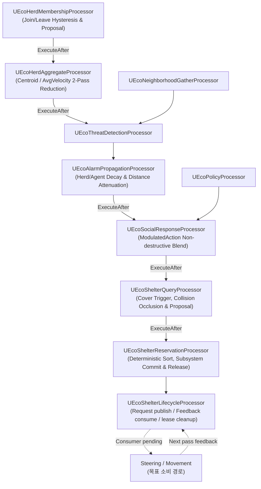

# Social Behavior & Shelter Runtime — Current State & Implementation Status

> **2026-10-08 추가 통합 기록 (`47faebc` 이후 작업 트리):** 실제 사슴·늑대 BP/BS와 별도 opt-in EntityConfig/레벨에서 기존 PPO→Social Request→단일 이동→Feedback 및 기존 Mass Bubble Client 표현을 연결했다. 직접 UBT 성공, 전체 자동화 33/33, 실제 별도 서버 80초/Client 40초 정상 종료·Moving→Occupied 확인. 아래의 2026-09-30/10-05 표와 JYU 기록은 당시 범위로 보존한다. 최신 실행법·책임 경계·날씨/지형 등 미연결 범위는 [동물 production 통합 기록](CREATURE_PRODUCTION_INTEGRATION.md)을 먼저 읽는다.

> **Project:** AdaptiveEcosystem (Unreal Engine 5.8)  
> **Repository:** `dpqksr5501/AdaptiveEcosystem`  
> **Target Module:** `AdaptiveEcosystem` (Source/AdaptiveEcosystem/AI/Social/)  
> **Current Base:** `main` — `295ac2f` (2026-09-30 Source audit)
> **Working Branch:** `codex/social-shelter-handoff` — HEAD `7f44d5e` (`9461ae7` 기반); 감각·인지 확장은 작업 트리 변경
> **Current Phase:** Production Integration
> **Historical MVP Branch:** `feat/social-shelter-mvp` (main에 병합됨)
> **Last Updated:** 2026-10-05
> **Status:** Dynamic Herd MVP (Editor Verified) / Alarm Communication MVP (Editor Verified) / Shelter MVP (Editor Verified: 차폐 판정 및 예약 표시)
> **최신 작업 트리 검증 — 2026-10-05:** 감각·인지 인계 계약 및 보정 진단 추가 후 직접 UBT 성공 및 Social 자동화 **17/17 통과** (Senses 7 + ActionAudit 1 + Threat 4 + Lifecycle 5). [감각·인지 구현 및 검증](SOCIAL_SENSORY_RUNTIME.md)을 따른다. 2026-10-02의 14/14와 기존 9/9 기록은 각 구현 문서에 보존한다. 이전 사용자 PIE의 캐릭터 접근→Alert 확인은 [실제 위협 연동 기록](SOCIAL_THREAT_ALARM_INTEGRATION.md)에 보존한다. 새 감각 JYU PIE/오디오, PPO 인지 입력 소비·실제 이동 소비자·Moving/Occupied PIE·멀티플레이는 연결/검증 대기다.

---

## 1. 문서의 목적 (Purpose)

이 문서는 `AdaptiveEcosystem`의 **Social Behavior & Shelter Runtime**의 현재 실제 구현 상태와 검증 결과를 기록한 단일 진실 문서(Single Source of Truth)입니다.  
새로운 AI Agent나 팀원이 작업에 참여할 때, 기존 설계 문서의 '의도'와 현재 소스 코드의 '실제 구현 상태'를 혼동하지 않고 즉시 작업을 이어갈 수 있도록 다음 상태 기준에 따라 명확히 구분하여 기술합니다:

- **`Editor Verified`**: C++ 코드 구현 완료 및 Unreal Editor (PIE) 환경에서 기능 실증 완료
- **`Implemented`**: C++ 코드 구현 및 UBT 컴파일/링크 완료 (에디터 통합 실증 진행 전)
- **`Pending`**: 기본 뼈대(Skeleton/Stub) 코드는 소스에 존재하나, 정식 고도화 및 검증 대기 중
- **`Deferred`**: 현재 MVP 스코프에서 의도적으로 배제/연기된 기능
- **`Not yet integrated`**: 기능별 구현은 있지만 production 경로의 입력/소비자/생명주기 연결이 없음
- **`Requires verification`**: Source만으로 에셋 구성이나 실제 PIE 동작을 확정할 수 없음

### 1.1 Completed / Integration Pending

| 구분 | 현재 범위 |
| :--- | :--- |
| Implemented — 2026-10-02 작업 트리 | 시각·청각·개인 위협 기억·출처/신뢰도/불확실도, 별도 무리 정보, 서버 소음 이벤트/Emitter·선택적 SA 재생, 개체 프로필·환경 multiplier, Debug 표시. 직접 UBT와 14/14 자동화 통과. 후각 제외, PPO 인지 입력 소비·production/JYU/오디오 검증 대기. [상세 계약](SOCIAL_SENSORY_RUNTIME.md) |
| Implemented — 2026-10-05 작업 트리 | 읽기 시각 감쇠·개인/무리 단서 분리 API, 원 입력/수신 시각·persistent Herd 검증, PPO Raw/Effective 보정 진단. 직접 UBT 및 Social 17/17 통과. 기존 V1 행동 수식과 이동 writer 유지. 검증 기록 및 타 담당 연결은 [인지 계약 §7–9](SOCIAL_SENSORY_RUNTIME.md#7-인지-정보-인계-계약--2026-10-05-구현) 참조 |
| 표현/시연 별도 작업 — 2026-10-05 | 사용자 요청에 따라 임시 늑대/초식동물 BP·공통 표현 Actor·전용 평면 맵 추가. 기존 PPO/테스트 포식자 이동을 시각화하며 Social 목적지 소비나 production Entity 통합과 구분한다. [BP 실행·인계 문서](CREATURE_BP_DEMO_AND_REPRESENTATION.md) |
| Completed | Herd 가입/이탈·집계, Alarm 주입/전파·감쇠·Social Response, authored Shelter 선택·LOS/차폐·슬롯 예약. 기존 Herd/Alarm PIE 기록과 Shelter 차폐/예약 표시 기록 보존 |
| Implemented — 작업 브랜치 | 실제 Mass 포식자/Actor 위협 컴포넌트 → 시야/LOS 감지 → Herd Alarm. 입력 갱신/종료 및 움직이는 위협 위치 수정. [연동 계약 및 검증](SOCIAL_THREAT_ALARM_INTEGRATION.md) |
| Implemented — 작업 브랜치 | Request/Feedback 인계 계약, 예약 세대 번호, Reserved→Moving→Occupied 전이·lease 유지, 실패/진행 정체/위협 요구 종료·죽음/삭제/이주 예약 정리. [구현·검증 범위](SOCIAL_MOVEMENT_HANDOFF_AND_SHELTER_LIFECYCLE.md) |
| Implemented — 진단 로그 | `eco.Shelter.Log 1/2`와 `LogEcoSocialShelter`: 상태/lease 이벤트 및 5초 요약. 로그 활성 상태로 직접 UBT 성공·자동화 9/9 통과. [JYU 실행·로그 전달 절차](SOCIAL_MOVEMENT_HANDOFF_AND_SHELTER_LIFECYCLE.md#61-에디터-실행과-로그-전달) |
| 사용자 JYU 확인 — 2026-09-30 | Standalone 로그에서 100개체 요청, 은신처 3곳 예약, 12초 TTL 만료·재예약, 개별 은신 요구 종료 반환 및 PIE 재시작 초기화를 확인. 실제 이동/Occupied·전체 위협 종료·후보 없음·Client 검증과 구분. [사용자 로그 검증 기록](SOCIAL_MOVEMENT_HANDOFF_AND_SHELTER_LIFECYCLE.md#사용자-jyu-pie-로그-확인--2026-09-30) |
| HUD 수정 — 2026-10-01 | 예약된 개체의 Panic 글자가 점수 색상에 가려지던 표시 문제 수정. 경보/예약 정보를 두 줄로 출력하며 Agent ID·경보 강도를 함께 표시. 직접 UBT 성공, 수정 후 시각 PIE 확인 대기. [색상 해석·수정 기록](SOCIAL_MOVEMENT_HANDOFF_AND_SHELTER_LIFECYCLE.md#hud-색상-혼동-수정--2026-10-01) |
| 사용자 JYU 재확인 — 2026-10-01 | 차폐 1.0/노출 0.1 표시, 슬롯 예약 및 Panic 강도를 화면·로그로 재확인. 사용자가 현재 테스트 동작을 정상으로 확인. 실제 이동/점유 완료를 의미하지 않음. [브랜치 포함 관계·작업 정리](SOCIAL_MOVEMENT_HANDOFF_AND_SHELTER_LIFECYCLE.md#9-브랜치-포함-관계와-작업-정리--2026-10-01) |
| Integration Pending | production EntityConfig 및 JYU/Client 확인, 기존 단일 이동 writer의 Request 소비·Feedback 반환, 실제 이동/도착/종료 및 전체 end-to-end 검증 |
| Deferred | Merge/Split 고도화, cross-herd multi-hop gossip, RVO2/ORCA, 자동 Cover 생성, 복잡한 Leader AI, Group Shelter 최적화, 새로운 PPO 관측/행동 차원 |

### 1.2 Source-derived Audit Findings — main `295ac2f`

아래 표는 **수정 전 main 감사 기록**이다. 최신 브랜치에는 ThreatDetection, Actor ThreatSource, Client Trait 제외, Request/Feedback 및 Lifecycle이 추가됐다. [실제 위협 연동](SOCIAL_THREAT_ALARM_INTEGRATION.md)과 [이동 인계·예약 생명주기](SOCIAL_MOVEMENT_HANDOFF_AND_SHELTER_LIFECYCLE.md)를 먼저 확인한다. 표의 당시 미구현 사실을 현재 브랜치 상태로 읽지 않는다.

| 확인 질문 | 현재 Source의 답과 근거 |
| :--- | :--- |
| Steering의 Action 입력 | [`UEcoSteeringProcessor`](../../Source/AdaptiveEcosystem/AI/Policy/EcoBehaviorProcessors.cpp)는 `FEcoPolicyOutputFragment::Action`을 직접 읽는다. `FEcoSocialBehaviorFragment`/`FEcoShelterIntentFragment` 요구·소비는 없다 |
| Social 출력 소비 | [`UEcoSocialResponseProcessor`](../../Source/AdaptiveEcosystem/AI/Social/Alarm/EcoAlarmProcessors.cpp)는 Raw Action을 ReadOnly로 읽고 `ModulatedAction`만 쓴다. Shelter Query가 Cover를 소비하지만 실제 이동은 미연결 |
| Shelter 목적지 소비 | [`UEcoShelterReservationProcessor`](../../Source/AdaptiveEcosystem/AI/Social/Shelter/EcoShelterProcessors.cpp)가 슬롯 예약 후 `TargetPosition`을 기록한다. production 이동 소비자와 `Moving`/`Occupied` 전이는 없다 |
| 실제 Alarm 입력 | C++ 외부 호출자는 [`AEcoAlarmTestHarnessActor`](../../Source/AdaptiveEcosystem/Debug/EcoAlarmTestHarnessActor.cpp)다. Player/Predator→EmitHerdAlarm/EmitSpatialAlarm 연결은 not yet integrated. Blueprint 동작을 Source 검색만으로 보증하지 않는다 |
| Migration / Steering 분리 | 아래 1.3의 두 이동 경로는 현재 M3 Bootstrap 가드로 혼용이 차단된다. 단일 production 경로의 최종 인계 계약은 아직 미정 |
| production Entity에 Social 포함 | [`UEcoSocialTrait`](../../Source/AdaptiveEcosystem/AI/Social/EcoSocialTrait.cpp)는 4개 Social Fragment와 Social Shared Config만 추가한다. Network Trait는 Social/Policy/Species Shared를 추가하지 않고 Bootstrap은 이를 검증하지 않는다. 실제 EntityConfig의 Trait/부모 구성은 에디터 확인 필요 |
| Server/Standalone 전용 Social 실행 | Herd/Shelter Subsystem은 `NM_Client` 생성을 막는다. Social Processor는 로컬 UE 5.8 `UMassProcessor` 기본값 `Server | Standalone`을 상속한다. 프로젝트 Config에서 Social ExecutionFlags override는 확인되지 않아 기본 자동 실행은 서버/Standalone이다. query는 Alive만 요구하며 Authority/ClientProxy 조건은 없고 Trait도 Client를 분기하지 않는다. 에디터 설정 override·수동 실행·실제 Client 구성은 별도 확인 필요 |

엔진 대조 근거: 로컬 UE 5.8 `Engine/Source/Runtime/MassEntity/Private/MassProcessor.cpp`, `UMassProcessor::UMassProcessor()`의 ExecutionFlags 초기화. 프로젝트 Source의 명시적 설정 부재를 Client 실행으로 단정하지 않는다.

**테스트 Entity와 production Entity를 구분한다.** [`AEcoHerdTestHarnessActor::SpawnTestHerds`](../../Source/AdaptiveEcosystem/Debug/EcoHerdTestHarnessActor.cpp)는 Social/Policy/Alive/Species Shared를 직접 구성하고 고정 Raw Action과 테스트 ID를 넣는다. Herbivore/관측·추론/Network·Travel 통합 Entity를 만드는 경로가 아니다. [`AEcoPolicyTestSpawner`](../../Source/AdaptiveEcosystem/Debug/EcoPolicyTestSpawner.cpp)는 별도 PPO 시연·포식자 이동·리스폰 대역이다. JYU에서 표시가 정상이라는 사실을 production 이동 검증으로 확대하지 않는다.

### 1.3 Movement Writer Ownership — 현재와 목표

| 경로 | 위치/속도 작성자 | 현재 분리 장치 |
| :--- | :--- | :--- |
| PPO Herbivore | `UEcoSteeringProcessor`가 `EcoPolicy::Steer`로 속도를 계산하고 `FMassVelocityFragment`와 Transform을 직접 갱신 | [`UEcoHerbivoreTrait`](../../Source/AdaptiveEcosystem/AI/Policy/EcoBehaviorTraits.cpp)의 `FMassCustomMovementTag`로 엔진 ApplyMovement 제외 |
| M3 Box / Migration | `UEcoMigrationSteeringProcessor`가 `FMassDesiredMovementFragment::DesiredVelocity`를 쓰고 엔진 `UMassApplyMovementProcessor`가 속도·Transform 적분 | [`AEcoMassNetworkBootstrap::ValidateConfiguration`](../../Source/AdaptiveEcosystem/Mass/EcoMassNetworkBootstrap.cpp)가 Herbivore/Custom/Spring Movement 및 Simulation LOD 혼용을 거절 |
| M3 조정 경계 | `EcoMassMigration::Reconcile`은 Travel·Region을 조정하며 non-Traveling의 DesiredVelocity와 Velocity를 0으로 리셋 | PPO와 합치면 속도 덮어쓰기/이주 목적지 무시 위험. 현 가드를 제거해 해결하지 않는다 |
| Social | ModulatedAction·Shelter 목적지·예약 상태만 작성 | 실제 Transform/Velocity writer가 아님 |
| Client | Bubble/Representation이 수신 Transform·표현을 반영 | 서버 논리 행동을 재계산하는 이동 경로가 아님 |

현재 `AI/Policy`는 자체 `UEcoNeighborhoodSubsystem` 격자와 직접 속도 조향을 사용한다. 프로젝트 Source에서 별도 `UEcoFlockSteeringProcessor`/MassFlock runtime 구현은 확인되지 않았다. 문서의 MassFlock/HashGrid/Force 합성은 설계·참조 용어다. 두 production 이동 경로의 결합을 완료했다고 표현하지 않는다.

**Social handoff contract (Implemented; consumer pending):** Lifecycle이 `FEcoSocialMovementRequestFragment`로 보정 Action·유효 예약 목적지를 제공하며 `FEcoShelterMovementFeedbackFragment`의 예약 번호·Sequence·결과를 소비한다. Movement 담당 계층이 최종 우선순위와 실제 이동을 한 경로에서 실행한다. Raw Action은 유지한다. 목적지 인계는 장애물 우회·경로 도달 가능성을 보증하지 않는다. 상세 필드·타임아웃·담당자 인계는 [계약 문서](SOCIAL_MOVEMENT_HANDOFF_AND_SHELTER_LIFECYCLE.md)를 따른다.

### 1.4 CURRENT PRIORITY — Production Integration

1. 실제 Player / Predator Threat → Alarm 코드 연결 완료. production EntityConfig 및 JYU 실제 입력·권위/Client 확인.
2. Social은 EffectiveAction 제공까지 구현. 기존 Steering 소비는 이동 담당자 연결 대기.
3. 유효 예약 목적지 Request와 Feedback 계약 구현. 단일 이동 writer 연결 대기.
4. Reserved → Moving / Occupied 전이·도착 검증·예약 유지 구현 및 자동화 검증. 실제 이동 PIE 대기.
5. 은신 요구 종료 / Death / Despawn / Migration 예약 정리 구현 및 자동화 검증. production 통합 확인 대기.
6. 전체 end-to-end scenario validation 및 Listen Server/Client 검증.

위 순서는 기능 우선순위다. 작업 브랜치에 Policy→Social Response를 명시했다. Shelter Reservation→Steering 소비 연결은 없으며, 단일 movement writer와 행동/목적지 우선순위는 이동 담당자와 확정한다.

**가장 작은 다음 작업:** 이동 담당자가 [Request/Feedback 계약](SOCIAL_MOVEMENT_HANDOFF_AND_SHELTER_LIFECYCLE.md)에 맞춰 기존 writer 하나를 연결한다. production EntityConfig 구성과 Shelter/Migration/Flee 우선순위를 검토하고 실제 이동·도착·실패·종료를 JYU에서 확인한다.

최종 검증 시나리오 (planned):

```text
Player / Predator 접근 → Threat 감지 → Herd Alarm → 구성원 Social Response
→ ModulatedAction → Safe Shelter 선택 → Slot reservation → TargetPosition
→ Movement → 도착 / Occupied → Threat clear / Death / Migration → Reservation release
```

### 1.5 폐루프 관련 타 계층의 연결 공백

- [`UEcoWorldProviderRegistry`](../../Source/AdaptiveEcosystem/AI/Policy/EcoWorldProviders.cpp)는 Dummy Food/Cover를 기본으로 설정한다. Source에서 SetFoodProvider/SetCoverProvider 교체 호출은 없다. Policy의 cover distance와 실제 예약 목적지는 의미를 분리해 유지한다.
- 정책 recent_predation은 별도 `UEcoRegionPredationSubsystem` 격자 EMA다. Ecology의 RegionId/PredationHistory와 연결되지 않았다. 개체별 `ReportPopulation(Location, 1)`과 수신 `max`의 조합은 분모를 1에 머물게 하므로 RL 담당 수정·검증이 필요하다. 문서 감사에서는 Source를 고치지 않았다.
- M3 Feeding은 지급량을 Fragment에 기록하지만 Energy/HP로 환산하지 않는다. Policy 포획은 HP=0과 별도 EMA 보고까지이고, 테스트 Spawner의 리스폰은 정식 Death/Despawn/Population 처리와 다르다. 새 Social Lifecycle은 HP/Alive/Travel·owner를 읽어 예약을 정리하며 생명주기 자체를 구현하지 않는다.
- V1 문서/계약 헤더와 생성된 `EcoBehaviorConfig`의 정규화 상수, 두 Utility 수식, 힘 합성 설명과 실제 일정 속력 조향이 다르다. 7→4 스키마는 유지하되 수치 계약 정합성은 RL 담당과 별도 검증한다. M3 전체/M4/M5 완료로 기록하지 않는다.

---

## 2. 시스템 책임 경계 (System Boundaries & Ownership)

### 2.1 4대 계층 분리 원칙 (Target Architecture; handoff는 미통합)

```text
┌────────────────────────────────────────────────────────────────────────┐
│ 1. RL / PPO Behavior Policy (herbivore_rl / SB3 / C++ Native Inference) │
│    - 책임: 개체의 고수준 행동 선호도(Behavior Tendency) 결정              │
│    - 입출력 불변 계약: Observation 7차원 / Raw Action 4차원               │
│    - Action = [ Forage, Cohesion, FleeDist, Cover ] (0.0 ~ 1.0)        │
└───────────────────────────────────┬────────────────────────────────────┘
                                    │ Raw Policy Action
                                    ▼
┌────────────────────────────────────────────────────────────────────────┐
│ 2. Social Behavior & Shelter Runtime (내 담당 영역)                      │
│    - 책임: 사회적 환경 문맥 판단, 군집 형성, 위험 전파, 은신처 슬롯 예약     │
│    - 산출물: FEcoSocialBehaviorFragment::ModulatedAction, TargetPosition │
│    - 역할: PPO Raw Action을 비파괴 보정하고 이동 목적지(Intent) 결정       │
└───────────────────────────────────┬────────────────────────────────────┘
                                    │ ModulatedAction & TargetPosition (planned handoff)
                                    ▼
┌────────────────────────────────────────────────────────────────────────┐
│ 3. Steering / Movement (다른 담당 계층; 최소 adapter는 계약 후 구현)     │
│    - 책임: 개체의 실제 물리적 이동, 조향(Steering), 로컬 군집 이동 실행     │
│    - 주의: Social Runtime은 '어디로 갈지(Intent)'만 제공하며,           │
│            '어떻게 이동할지'는 현재 이동 경로의 담당 계층이 소유         │
└────────────────────────────────────────────────────────────────────────┘
                                    │
┌───────────────────────────────────┴────────────────────────────────────┐
│ 4. World / Ecology Simulation (Server / Standalone Authoritative)       │
│    - 책임: 생태계 자원, 영속 ID, 피식 기록 관리 (Subsystem은 로컬 서비스)│
└────────────────────────────────────────────────────────────────────────┘
```

### 2.2 엄격한 제약 사항

**Herd != Flock**: Herd는 지속적인 논리적/사회적 무리이며 Flock / Steering은 실제 이동 행동이다. RL/Movement/Network 구현을 Social의 기여로 기록하지 않는다.

1. **PPO Policy V1 계약 불변**: 7차원 관측, 4차원 행동의 순서, 정규화 공식, 클램프 범위 수정 금지.
2. **PPO Raw Action 보존**: Social/Movement는 `FEcoPolicyOutputFragment`를 ReadOnly로 소비하며 보정값으로 덮어쓰지 않는다. Policy Processor가 새 추론 결과를 갱신하는 것은 정상이다.
3. **MassFlock 침범 금지**: 로컬 조향 로직을 Social Runtime에 작성하지 않음.
4. **GameThread 직렬화 준수**: Mass 병렬 청크 루프 내부에서 `UWorldSubsystem`의 가변 상태를 직접 수정하지 않고, **Proposal $\to$ Deterministic Reconciliation $\to$ Commit** 패턴 사용.
5. **LOS/Occlusion 검증**: 실제 언리얼 지형/구조물에 Visibility 구체 스위프 및 복잡 충돌/오브젝트 타입 추적을 수행해 위협 대비 차폐 여부를 검증.

---

## 3. 전체 데이터 흐름 및 Mass Processor 실행 순서

### 3.1 런타임 데이터 흐름 (Runtime Flow)
1. **Policy 추론**: 별도 PPO 경로에서 7차원 관측을 읽어 `FEcoPolicyOutputFragment.Action` 출력. JYU Herd Harness의 Raw Action은 고정 테스트 입력이다.
2. **Herd 갱신**: 인접 엔티티들이 Hysteresis 반경을 기반으로 무리에 소속되고 중심/평균속도 산출.
3. **Threat 수신 & 감쇠**: 외부 위협 발생 시 Herd가 수신 후 구성원에게 거리 지수 감쇠($e^{-\alpha d}$) 전파 및 시간 감쇠.
4. **상태 머신 전이**: 감쇠 강도에 따라 `Calm` $\leftrightarrow$ `Alert` $\leftrightarrow$ `Panic` $\leftrightarrow$ `Recovering` $\leftrightarrow$ `Regrouping` 전이.
5. **Social Response 변조**: 개체별 상태에 따라 `FEcoSocialBehaviorFragment.ModulatedAction`에 안전하게 보정값 산출.
6. **Shelter 질의**: `Panic` 상태이거나 `ModulatedAction.Cover >= 0.25f`인 개체가 위협 위치 및 지형 차폐도를 고려하여 은신처/슬롯 탐색 (`Searching`).
7. **결정론적 예약 중재**: 동일 슬롯 경합 시 `Score` 내림차순 및 `StableAgentId` 오름차순 타이브레이크를 거쳐 단일 승자 확정 (`Reserved`), `TargetPosition` 확정.
8. **Lifecycle과 인계**: 예약 번호가 일치하는 새 이동 결과와 실제 위치로 Moving/Occupied를 판정한다. 유효한 진행/점유는 lease를 갱신한다. 은신 요구 종료, 실패/양보, heartbeat 중단/정체, 죽음/이주/삭제 시 해제한다. 실제 이동은 Request 소비자 연결 대기다.

### 3.2 Mass Processor 명시적 실행 순서 (Phase: `PrePhysics`, Group: `Behavior`)

```mermaid
graph TD
    A["UEcoHerdMembershipProcessor<br/>(Join/Leave Hysteresis & Proposal)"] -->|ExecuteAfter| B["UEcoHerdAggregateProcessor<br/>(Centroid / AvgVelocity 2-Pass Reduction)"]
    B -->|ExecuteAfter| T["UEcoThreatDetectionProcessor"]
    G["UEcoNeighborhoodGatherProcessor"] --> T
    T --> C["UEcoAlarmPropagationProcessor<br/>(Herd/Agent Decay & Distance Attenuation)"]
    C -->|ExecuteAfter| D["UEcoSocialResponseProcessor<br/>(ModulatedAction Non-destructive Blend)"]
    P["UEcoPolicyProcessor"] --> D
    D -->|ExecuteAfter| E["UEcoShelterQueryProcessor<br/>(Cover Trigger, Collision Occlusion & Proposal)"]
    E -->|ExecuteAfter| F["UEcoShelterReservationProcessor<br/>(Deterministic Sort, Subsystem Commit & Release)"]
    F --> L["UEcoShelterLifecycleProcessor<br/>(Request publish / Feedback consume / lease cleanup)"]
    L -.->|Consumer pending| H["Steering / Movement<br/>(목표 소비 경로)"]
    H -.->|Next pass feedback| L
```

---

## 4. Dynamic Herd MVP (`Editor Verified`)

- **상태**: **Editor Verified** (2026-09-21 검증 완료)
- **목적**: 개체들을 지리적/사회적으로 지속성 있는 무리(Persistent Herd)로 묶고 중심 및 이동 상태를 단일 진실값으로 유지.

### 4.1 구현 상세 (Implemented)
1. **영속 식별자 관리**: `UEcoHerdSubsystem`을 통해 무리별 단조 증가 영속 ID(`PersistentHerdId`) 발급 및 Dense Runtime 배열(`ActiveHerds`) 관리.
2. **Hysteresis 가입/이탈**:
   - `HerdJoinRadius` (800cm) 이내 지속 체류 시 가입 제안. Shared Config 기본 Join Dwell은 1.0s, Herd Harness는 0.5s.
   - `HerdLeaveRadius` (1400cm) 초과 지속 체류 시 이탈 처리. Shared Config 기본 Leave Dwell은 2.0s, Herd Harness는 1.0s.
   - Join < Leave 설정을 통해 경계 부근의 진동(Fluttering) 원천 방지.
3. **GameThread에서의 2-Pass Reconciliation**:
   - 현재 Membership/Aggregate는 GameThread 필수 실행이다. 평가와 무리 생성/집계를 나누어 직렬 조정한다. 병렬 구현 완료를 뜻하지 않으며 병렬화 시 read snapshot과 요청 버퍼 경계가 필요하다.
4. **주기적 인터벌 실행**:
   - `UEcoHerdMembershipProcessor`: 0.5초(2Hz) 주기 평가.
   - `UEcoHerdAggregateProcessor`: 0.1초(10Hz) 주기 집계.
5. **Mass Spawner 연동 Trait**: `UEcoSocialTrait`를 통해 Mass Entity Template에 4대 소셜 프래그먼트와 종단위 공유 설정(`FEcoSocialSpeciesSharedFragment`) 자동 바인딩.

### 4.2 에디터 실증 결과 (Editor Verified)
- 테스트 하네스: [`AEcoHerdTestHarnessActor`](../../Source/AdaptiveEcosystem/Debug/EcoHerdTestHarnessActor.h)
- 100마리의 엔티티를 3개 클러스터에 초기 배치 후 PIE 실행.
- 무리 분할 실측: `Herd #0 (33마리)`, `Herd #1 (33마리)`, `Herd #2 (34마리)`로 100마리 전원 누락 없이 독립 무리 형성.
- 3D HUD 와이어프레임(에메랄드 중심 구체, 800cm 가입 원, 1400cm 이탈 원, 평균 속도 화살표) 실시간 렌더링 검증 완료.

---

## 5. Alarm Communication MVP (`Editor Verified`)

- **상태**: **Editor Verified** (2026-09-21 검증 완료)
- **목적**: 외부 위협을 특정 무리 또는 공간에 주입하고, 무리 단위 전파 및 거리/시간 감쇠를 통해 자연스러운 공황 및 평화 복귀를 유도.

### 5.1 구현 상세 (Implemented)
1. **Threat Injection API (`UEcoHerdSubsystem`)**:
   - `EmitHerdAlarm(int32 HerdIndex, const FVector& ThreatLocation, float Strength)`: GameThread 직렬화 호출 보장.
   - 작업 브랜치에서는 수동 입력과 실제 감지 입력을 분리한다. 수동 채널 내부의 강도 우선 정책은 유지하며 실제 감지는 매 패스 교체한다. 최종 Herd 출력은 두 입력 중 강한 입력이다.
   - `EmitSpatialAlarm(const FVector& ThreatLocation, float Radius, float Strength)`: 공간 반경 내 무리 일괄 전파.
   - `DecayHerdAlarms(float DeltaTime, float DecayRate)`: 무리 차원 알람 자연 감쇠.
   - `ClearHerdAlarms()`: 현재 두 입력 초기화. 실제 위협이 계속 보이면 다음 감지 패스에서 다시 경보가 들어온다. 종료 검증은 위협 소스도 비활성화해야 한다.
2. **거리 지수 감쇠 및 시간 감쇠**:
   - 개체 수신 강도: $\text{ReceivedStrength} = \text{Herd.AlarmStrength} \times e^{-\alpha \cdot \text{DistToThreat}}$ ($\alpha = 0.001$).
   - 개체 시간 감쇠: $\text{AlarmStrength} \leftarrow \max(0, \text{AlarmStrength} - \beta \cdot \Delta t)$ ($\beta = 0.2$).
3. **사회적 상태 머신 (5단계)**:
   - $\ge 0.6$: 🔴 **`Panic`**
   - $\ge 0.2$: 🟡 **`Alert`**
   - $> 0.0$: 🔵 **`Recovering`** (또는 미소속 시 🟣 **`Regrouping`**)
   - $== 0.0$: 🟢 **`Calm`**
4. **FMassEntityQuery 초기화**:
   - 현재 production Processor는 `EntityQuery(*this)`와 `ConfigureQueries`를 사용한다. Debug Harness의 수동 query 초기화와 구분하며 과거 Assertion 수정 기록을 현 Processor API로 확대하지 않는다.

### 5.2 에디터 실증 결과 (Editor Verified)
- 테스트 하네스: [`AEcoAlarmTestHarnessActor`](../../Source/AdaptiveEcosystem/Debug/EcoAlarmTestHarnessActor.h)
- **평상시 (`Continuous Threat = false`)**: 전 개체 🟢 `[Calm] Str: 0.00`, Raw Action과 Modulated Action 일치 확인.
- **지속 위협 (`Continuous Threat = true`)**:
   - 위협 근접 개체: 🟡 `[Alert]` (주황색 구체)
   - 외곽/재집결 개체: 🟣 `[Regrouping / Recovering]` (보라색 구체)
   - 실시간 거리 감쇠 및 상태 분기 확인.
- **위협 종료 (`ClearAllAlarms`)**:
   - 즉각 0 리셋이 아닌 시간 감쇠를 거쳐 `Panic` $\to$ `Alert` $\to$ `Recovering` $\to$ `Calm` 자연 복귀 확인.

---

## 6. Raw PPO vs ModulatedAction 분리 계약

PPO 정책 네트워크의 무결성을 보장하기 위해 데이터 구조를 엄격히 물리 분리했습니다:

```cpp
// 1. Raw Policy Output (PPO 원본 — 절대 수정 금지, ReadOnly)
FEcoPolicyOutputFragment::Action (FEcoPolicyActionV1)
  - Forage: 0.80
  - Cohesion: 0.50
  - FleeDist: 0.20
  - Cover: 0.10

// 2. Modulated Social Behavior (Social Runtime 산출물 — 비파괴 보정)
FEcoSocialBehaviorFragment::ModulatedAction (FEcoPolicyActionV1)
  - Forage: 0.04   (Panic 시 극단적 억제: RawAction.Forage * 0.05)
  - Cohesion: 0.75 (Panic 시 결집력 증폭: RawAction.Cohesion * 1.5)
  - FleeDist: 0.63 (Panic 시 도주 민감도 증폭: RawAction.FleeDist + 0.5 * AlarmStrength)
  - Cover: 0.61    (Panic 시 은신처 갈망 증폭: RawAction.Cover + 0.6 * AlarmStrength)
```

- **성과**: 매 틱 원본에 곱셈을 수행하여 수치가 0으로 수렴/파괴되던 복리 감쇠 버그(Compounding Bug) 원천 해결.

---

## 7. Shelter / Cover Runtime 현황 (`Editor Verified`)

- **상태**: **Editor Verified** (2026-09-23 `Lvl_JYU` PIE에서 벽 뒤/노출 은신처의 차폐 점수와 슬롯 표시 확인)
- **구현 이력 브랜치**: `feat/social-shelter-mvp` (현재 기준은 main)
- **핵심 소스 파일**:
  - [`EcoShelterAnchor.h / .cpp`](../../Source/AdaptiveEcosystem/AI/Social/Shelter/EcoShelterAnchor.h): 레벨 배치형 은신처 앵커 액터.
  - [`EcoShelterSubsystem.h / .cpp`](../../Source/AdaptiveEcosystem/AI/Social/Shelter/EcoShelterSubsystem.h): 슬롯 등록/예약/해제 및 위협 지형 차폐 판정.
  - [`EcoShelterProcessors.h / .cpp`](../../Source/AdaptiveEcosystem/AI/Social/Shelter/EcoShelterProcessors.h): `UEcoShelterQueryProcessor`, `UEcoShelterReservationProcessor`.
  - [`EcoShelterTestHarnessActor.h / .cpp`](../../Source/AdaptiveEcosystem/Debug/EcoShelterTestHarnessActor.h): 3D/2D HUD 및 에디터 검증 하네스 액터.

### 7.1 구현 상세 (Implemented)
1. **PPO Modulated Cover 트리거 연동**:
   - `FEcoPolicyOutputFragment`의 원본을 건드리지 않고, [`FEcoSocialBehaviorFragment::ModulatedAction.Cover`](../../Source/AdaptiveEcosystem/AI/Social/EcoSocialFragments.h#L100-L115) $\ge 0.25f$ 또는 `EEcoSocialState::Panic` 상태를 기준으로 은신처 탐색 개시.
2. **실제 물리 지형 차폐 검증 (Threat-relative World Occlusion)**:
   - 위협 위치(`LastThreatPosition`)에서 은신처까지 Visibility 구체 스위프를 우선 수행하고, 복잡 충돌 라인 추적 및 WorldStatic/WorldDynamic/PhysicsBody 오브젝트 추적으로 보완.
   - 위협이 월드 원점 `(0, 0, 0)`에 있어도 유효한 좌표로 처리. 위협 유무는 좌표값이 아닌 알람 상태로 판정.
   - 지형에 의해 완전히 가려진(Hit) 경우 은신처 차폐 점수 $1.0$, 노출된 경우 $0.1$ 부여. 위협 반대 방향 법선 보너스 가산.
3. **복합 은신처 평가 점수 (Composite Scoring)**:
   - $\text{Score} = \text{Quality} \times 0.25 + \text{DistanceRatio} \times 0.35 + \text{OcclusionScore} \times 0.40$
   - 거리뿐만 아니라 실제 안전 차폐도와 은신처 품질이 반영되어 노출된 가까운 은신처보다 지형 뒤 안전한 은신처 우선 선택.
   - Source는 차폐/거리 평가에 Shelter 중심을 사용한다. 최종 예약 슬롯의 LOS/경로 도달 가능성은 별도 검증되지 않는다. 위협이 없을 때 Occlusion은 0.5이며, 위협이 있을 때 노출 기본 0.1에 법선 보너스가 더해져 최대 0.25가 될 수 있다. HUD의 1.0/0.1 차폐 표시는 이 최종 보너스 포함 점수와 구분한다.
4. **결정론적 슬롯 예약 중재 (Deterministic Reconciliation)**:
   - 병렬 청크에서 공유 배열에 무차별 등록하지 않고, `bRequiresGameThreadExecution = true`가 보장된 프로세서에서 제안 수집 후 정렬:
     1. `SlotIndex` 오름차순
     2. `Candidate Score` 내림차순 (점수 높은 개체 우선)
     3. `StableAgentId` 오름차순 (동점 시 고유 ID 기반 결정론적 타이브레이크)
   - 선착순 경합(First-Come-First-Served Race)을 완전히 제거.
5. **FEcoShelterIntentFragment 상태 머신 & TargetPosition 제공**:
   - `None` $\to$ `Searching` $\to$ `Reserved` 전이 흐름 확립.
   - 예약 승인 시 `TargetPosition = Slot.Position`을 기록하여 추후 MassFlock 이동 계층에서 참조할 단일 목적지 좌표 확립.
   - 당시 MVP는 Reserved까지였다. 현재 브랜치는 [Lifecycle](SOCIAL_MOVEMENT_HANDOFF_AND_SHELTER_LIFECYCLE.md)으로 Moving/Occupied 및 은신 요구 종료·죽음/이주/삭제 정리를 구현했다. 실제 이동 소비자와 PIE 검증은 별도 대기다.
6. **슬롯 원형 고른 분배 (Circular Slot Distribution)**:
   - `AEcoShelterAnchor` 등록 시 $\text{Angle} = \frac{2\pi \cdot \text{SlotIdx}}{\text{Capacity}}$ 공식으로 `Radius` 반경에 슬롯 균등 분배.

### 7.2 에디터 재현 절차와 확인 결과
1. **맵 구성**: `Content/Map/Lvl_JYU.umap`에 `AEcoHerdTestHarnessActor`, `AEcoAlarmTestHarnessActor`, `AEcoShelterTestHarnessActor`, 그리고 복수의 `AEcoShelterAnchor` (바위/벽 뒤 차폐 은신처 1개, 노출된 평지 은신처 1개) 배치.
2. **평상시 점검**: 위협이 없을 때 전 개체 은신처 상태 `None` 유지 확인.
3. **위협 주입 시 점검**: `AEcoAlarmTestHarnessActor`에서 `TriggerThreatAtActorLocation()` 또는 `bContinuousThreat = true` 설정:
   - `Cover` 욕구 상승 개체들이 `Searching` $\to$ `Reserved`로 전이되는지 확인.
   - 3D 뷰포트에서 지형 뒤 차폐된 은신처는 🟢 `[OCCLUDED - SAFE]` 녹색 선, 노출된 은신처는 🔴 `[EXPOSED - DANGER]` 적색 선이 그어지는지 확인.
   - 차폐된 은신처의 예약 슬롯과 개체-슬롯 연결선을 확인.
   - 단일 슬롯에 대해 높은 점수 및 낮은 AgentId 개체가 안정적으로 승리하는지 확인.
4. **위협 해제 시 점검 (수동 검증 대기)**: `ClearAllAlarms()` 호출 후 시간 감쇠를 관찰한다. `Reserved` 개체가 Panic이 아니고 Modulated Cover가 0.25 미만이면 슬롯 해제/🟢 `[Open]` 반환을 확인한다. Raw Cover가 높으면 Calm에서도 예약이 필요할 수 있으므로 상태 이름만으로 해제를 판정하지 않는다.

**확인된 결과**: `Lvl_JYU` PIE 화면에서 벽 뒤 `SHELTER #0`은 `[SAFE (WALL)]`, `OccScore: 1.0`, 위협과 같은 쪽의 `SHELTER #2`는 `[EXPOSED]`, `OccScore: 0.1`로 표시되고, 슬롯 예약 소유자와 개체별 점수도 표시됨. 여기서 슬롯 표시의 점유는 **예약 소유권**이며 실제 도착/`Occupied` 상태가 아니다. 단일 슬롯 경합 순서와 위협 해제 후 자동 반환은 별도 수동 검증 항목으로 유지.

---

## 8. 의도적으로 구현하지 않은 항목 (`Deferred`)

다음 고도화는 Production Integration 완료 뒤 검토한다:
1. **Cross-Herd Multi-hop Gossip (`FEcoAlarmSignal`)**: 개체 간 직접 가십 릴레이는 대규모 Mass 엔티티 환경에서 폭주 위험이 있으므로, 안전한 Herd 브로드캐스트만 유지.
2. **Herd Fission-Fusion (무리 분할 및 병합)**: 공황 시 무리 쪼개짐 및 평화 시 인접 무리 간 병합 토폴로지 연산.
3. **Local Avoidance (RVO2 / ORCA)**: Mass 기본 충돌/회피 우선 평가 후 필요시 별도 추진.

실제 Player/Predator 입력과 Social Moving/Occupied 상태 처리 코드는 구현했다. production EntityConfig·이동 소비자·PIE는 **Integration Pending / CURRENT PRIORITY**다. 초기 MVP의 제외 기록과 현재 구현을 구분한다.

---

## 9. 주요 코드 및 아티팩트 색인

| 카테고리 | 파일명 | 역할 및 상태 |
| :--- | :--- | :--- |
| **Types** | [`EcoSocialTypes.h`](../../Source/AdaptiveEcosystem/AI/Social/EcoSocialTypes.h) | `EEcoSocialState`, `EEcoShelterIntentState`, `FEcoHerdRuntimeData`, `FEcoShelterPoint`, `FEcoShelterSlot` (`Implemented`) |
| **Fragments** | [`EcoSocialFragments.h`](../../Source/AdaptiveEcosystem/AI/Social/EcoSocialFragments.h) | `FEcoHerdMemberFragment`, `FEcoAlarmStateFragment`, `FEcoShelterIntentFragment`, `FEcoSocialBehaviorFragment`, `FEcoSocialSpeciesSharedFragment` (`Implemented`) |
| **Trait** | [`EcoSocialTrait.h/.cpp`](../../Source/AdaptiveEcosystem/AI/Social/EcoSocialTrait.h) | Mass Spawner 템플릿용 소셜 컴포넌트 주입기 (`Editor Verified`) |
| **Herd** | [`EcoHerdSubsystem.h/.cpp`](../../Source/AdaptiveEcosystem/AI/Social/Herd/EcoHerdSubsystem.h) | 무리 중앙 레지스트리 및 위협 주입/감쇠 관리 (`Editor Verified`) |
| **Herd** | [`EcoHerdProcessors.h/.cpp`](../../Source/AdaptiveEcosystem/AI/Social/Herd/EcoHerdProcessors.h) | `UEcoHerdMembershipProcessor`, `UEcoHerdAggregateProcessor` (`Editor Verified`) |
| **Alarm** | [`EcoAlarmProcessors.h/.cpp`](../../Source/AdaptiveEcosystem/AI/Social/Alarm/EcoAlarmProcessors.h) | `UEcoAlarmPropagationProcessor`, `UEcoSocialResponseProcessor` (`Editor Verified`) |
| **Shelter** | [`EcoShelterAnchor.h/.cpp`](../../Source/AdaptiveEcosystem/AI/Social/Shelter/EcoShelterAnchor.h) | 레벨 배치형 은신처 앵커 및 원형 슬롯 분배 (`Editor Verified`) |
| **Shelter** | [`EcoShelterSubsystem.h/.cpp`](../../Source/AdaptiveEcosystem/AI/Social/Shelter/EcoShelterSubsystem.h) | 은신처/슬롯 중앙 관리, 지형 차폐 평가, 슬롯 예약 서브시스템 (`Editor Verified: 차폐/점유 표시`) |
| **Shelter** | [`EcoShelterProcessors.h/.cpp`](../../Source/AdaptiveEcosystem/AI/Social/Shelter/EcoShelterProcessors.h) | `UEcoShelterQueryProcessor`, `UEcoShelterReservationProcessor` (`Editor Verified: 질의/예약 표시`) |
| **Movement Contract** | [`EcoSocialMovementTypes.h`](../../Source/AdaptiveEcosystem/AI/Social/EcoSocialMovementTypes.h), [`EcoSocialFragments.h`](../../Source/AdaptiveEcosystem/AI/Social/EcoSocialFragments.h) | Request/Feedback와 immutable lifecycle 설정 (`Implemented`, 실제 소비자 대기) |
| **Shelter Lifecycle** | [`EcoShelterLifecycleProcessor.cpp`](../../Source/AdaptiveEcosystem/AI/Social/Shelter/EcoShelterLifecycleProcessor.cpp) | Moving/Occupied, lease·진행·도착·owner 정리 (`Implemented`, 자동화 검증) |
| **Debug** | [`EcoHerdTestHarnessActor.h/.cpp`](../../Source/AdaptiveEcosystem/Debug/EcoHerdTestHarnessActor.h) | 100마리 엔티티 생성 및 무리 중심/반경 3D 시각화 액터 (`Editor Verified`) |
| **Debug** | [`EcoAlarmTestHarnessActor.h/.cpp`](../../Source/AdaptiveEcosystem/Debug/EcoAlarmTestHarnessActor.h) | CallInEditor 위협 주입 및 실시간 개체 상태 HUD 시각화 액터 (`Editor Verified`) |
| **Debug** | [`EcoShelterTestHarnessActor.h/.cpp`](../../Source/AdaptiveEcosystem/Debug/EcoShelterTestHarnessActor.h) | 은신처/슬롯 점유 현황, 차폐선, 개체 예약 연결선을 보여주는 3D/2D HUD (`Editor Verified`) |
| **Test Map** | `Content/Map/Lvl_JYU.umap` | Herd/Alarm/Shelter 하네스를 배치한 PIE 테스트 맵 (`Editor Verified`) |

---

## 10. 소스 코드와 기존 설계 문서 간 차이점 명시 (Reconciliation)

1. **소셜 행동 보정 프래그먼트 신설**:
   - 기존 문서(`SOCIAL_BEHAVIOR_RUNTIME_ARCHITECTURE.md`)에는 `FEcoPolicyOutputFragment`에 직접 계수를 반영하는 형태가 고려되었으나, 실제 소스에서는 PPO 원본 보존을 위해 [`FEcoSocialBehaviorFragment`](../../Source/AdaptiveEcosystem/AI/Social/EcoSocialFragments.h#L100-L115)를 신설하고 `ModulatedAction`에만 결과를 기록합니다.
2. **Mass Processor 클래스 명칭**:
   - 초기 가이드의 `UEcoHerdCentroidProcessor`는 실제 코드베이스에서 2-Pass 집계 패턴을 명확히 반영한 [`UEcoHerdAggregateProcessor`](../../Source/AdaptiveEcosystem/AI/Social/Herd/EcoHerdProcessors.h#L41)로 구현되었습니다.
3. **위협 주입 경로 단일화**:
   - `FEcoAlarmSignal`의 가십 릴레이 대신 `UEcoHerdSubsystem::EmitHerdAlarm` 및 `EmitSpatialAlarm`을 통한 무리 기반 직렬화 주입 경로를 확립하여 멀티스레드 안정성을 확보했습니다.
4. **단순 법선 기반 은신처 평가 탈피**:
   - 초기 가이드의 법선 벡터 내적만으로 은신 여부를 판단하던 방식을 넘어, 실제 언리얼 충돌 추적으로 확인한 차폐 여부를 주 평가 요소(40% 가중치)로 반영했습니다.
5. **결정론적 예약 중재 메커니즘**:
   - Mass 엔티티 순회 순서에 따른 선착순 예약 문제를 제거하고, 점수(Score) 내림차순 및 `StableAgentId` 오름차순 타이브레이크를 통한 직렬화 중재를 적용했습니다.
